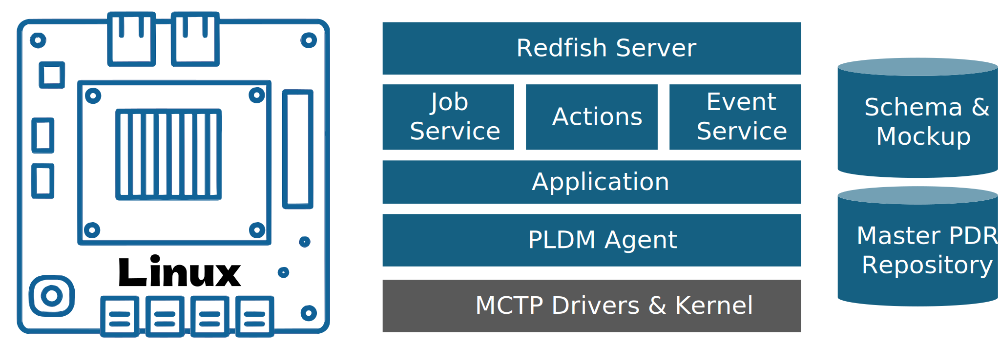

# PLDM Agent for IoT-Foundry

Lorem ipsum dolor sit amet, consectetur adipiscing elit. Nunc metus mi, laoreet facilisis est at, cursus egestas odio. Proin quis vestibulum magna. Donec varius est odio, non posuere augue vehicula in. Cras fermentum eu orci sed vestibulum. Maecenas vel venenatis dolor, in cursus enim. Etiam blandit tempor justo, nec euismod ligula fermentum imperdiet. Ut rhoncus porta ante at mollis. Aenean dapibus tempus auctor. Curabitur rutrum viverra est ac convallis. Aliquam sem urna, consectetur et nibh ut, accumsan tempus augue. Donec nulla odio, tempor in egestas commodo, rhoncus eget risus. Sed dapibus suscipit tempus. Lorem ipsum dolor sit amet, consectetur adipiscing elit. Ut dapibus neque at tortor convallis, a vehicula lorem dictum. Pellentesque imperdiet bibendum velit, nec dignissim nisl fermentum a. Nunc euismod eget tortor hendrerit feugiat. 

Nam in leo nisi. Nam vitae quam ut sapien tempus gravida sed accumsan sem. Sed tincidunt placerat hendrerit. Nunc eget leo lorem. Praesent quis posuere tellus. Nullam a ipsum a massa scelerisque vehicula ac sed eros. Donec leo tellus, ornare quis dignissim nec, ornare et nulla. Nulla varius quam a porttitor mattis. Praesent id venenatis orci. Phasellus sit amet felis libero. Nam et aliquet libero, sit amet bibendum felis. 

git clone --recurse-submodules https://github.com/PICMG/iot-foundry-pldm-agent.git

# Debian/Ubuntu
sudo apt-get install libudev-dev

# Fedora
sudo dnf install systemd-devel

# RHEL/CentOS
sudo yum install systemd-devel